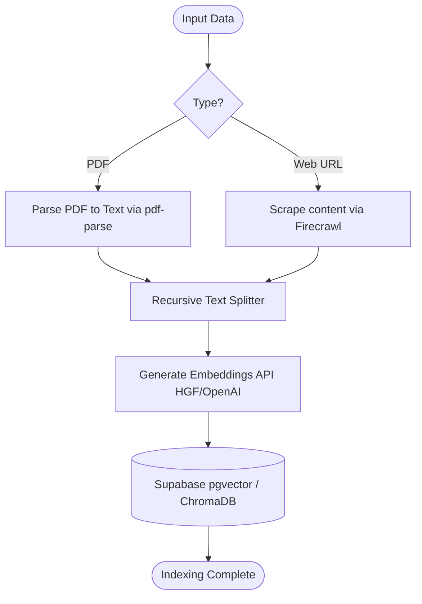
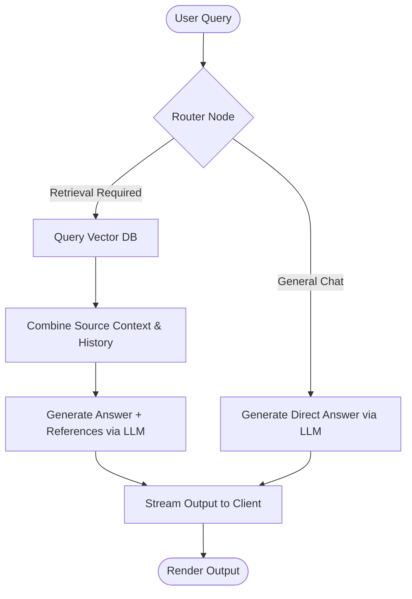

# Agentic AI PDF & Web Chatbot

An advanced, full-stack RAG (Retrieval-Augmented Generation) application designed for uploading, indexing, and conversing with PDF documents as well as web content. The system features a state-of-the-art agentic workflow orchestrating document ingestion, semantic vector retrieval, and contextual citations. 

Built using **LangGraph**, **LangChain**, **Next.js**, and supporting multiple Vector Databases (**Supabase**, **ChromaDB**) and LLM Providers (**OpenAI**, **Groq**, **Google Gemini**, **HuggingFace**).

[](#)
[](#)
[](#)
[](#)
[](LICENSE)

---

## 🌟 Key Features

- **Agentic RAG Workflows**: Utilizes **LangGraph** to model complex, state-driven search, routing, and ingestion pipelines.
- **Multi-Model LLM Support**: Dynamically swap between **OpenAI**, **Groq**, and **Google GenAI** for reasoning and generations.
- **Dynamic Retrieval Router**: Automatically determines if a query needs semantic document retrieval or if a direct model response is sufficient.
- **Flexible Vector Storage**: Support for both **Supabase (pgvector)** and local/remote **ChromaDB** for storing high-dimensional embeddings.
- **Advanced Document & Web Ingestion**: Ingests PDFs locally via `pdf-parse` and web pages dynamically using **Firecrawl**. Chunks text via recursive splitting and embeds it via **HuggingFace** or OpenAI.
- **Real-Time Stream Answering (SSE)**: Delivers partial responses to the frontend client UI in real time via Server-Sent Events (SSE).
- **Interactive Chat Interface**: Includes drag-and-drop file upload, inline conversational history, clear citations/sources view, and slick dynamic UI elements.
- **Turborepo Monorepo**: Cleaner code separating frontend and backend packages with instant caching and parallel builds.

---

## 🏗️ Architecture Overview

The system is designed with independent **Frontend** and **Backend** modules operating within a Turborepo-managed monorepo.

### 1. System Map

```text
┌─────────────────────┐    1. Ingest PDF/Web   ┌──────────────────────────────┐
│  Frontend (Next.js) │ ─────────────────────> │ Backend (Node.js/TS)         │
│  - React UI & Chat  │                        │ - LangGraph Agents           │
│  - File Uploads     │ <───────────────────── │ - Multi-LLM Interop          │
└─────────────────────┘     2. Acknowledge     │ - ChromaDB / Supabase Engine │
                                               └──────────────────────────────┘
┌─────────────────────┐    3. Query chat       ┌──────────────────────────────┐
│  Frontend (Next.js) │ ─────────────────────> │ Backend (Node.js/TS)         │
│  - Chat interface   │                        │ - Context Retrieval & Route  │
│  - SSE stream UI    │ <───────────────────── │ - Generation & Formatting    │
└─────────────────────┘      4. Stream SSE     └──────────────────────────────┘
```

### 2. Ingestion Flow (LangGraph)


### 3. Conversational Retrieval Flow (LangGraph)


---

## 🛠️ Tech Stack & Dependencies

- **Frontend**: Next.js 14 (App Router), React 18, Tailwind CSS, Radix UI.
- **Backend / Agent**: Node.js, TypeScript, LangChain v0.3, LangGraph v0.2, LangGraph SDK CLI.
- **Data Loaders**: `pdf-parse`, `@mendable/firecrawl-js`.
- **Database / Vector Engines**: Supabase (PostgreSQL with `pgvector`), ChromaDB.
- **AI Models & Embeddings**: OpenAI, Groq, Google Gemini, HuggingFace Inference.
- **Monorepo Management**: Turborepo, Yarn Workspaces.

---

## 📁 Repository Structure

```text
├── backend/                  # Node.js/TS LangGraph backend
│   ├── src/
│   │   ├── ingestion_graph/  # Agent for parsing and vector indexing
│   │   ├── retrieval_graph/  # Agent for QA, search routing, and chat
│   │   └── shared/           # Database clients, configurations
│   ├── package.json
│   └── tsconfig.json
├── frontend/                 # Next.js web application
│   ├── app/                  # App routes and API handlers
│   ├── components/           # Reusable React components
│   ├── package.json
│   └── tailwind.config.ts
├── package.json              # Monorepo root
└── turbo.json                # Turborepo task runner configuration
```

---

## ⚡ Setup & Installation

### 1. Prerequisites
- **Node.js**: v18+ (v20+ recommended)
- **Yarn**: package manager 
- **API Keys**: Access to OpenAI, Groq, Google Gemini, Firecrawl, or HuggingFace depending on your precise model choices.
- **Vector DB**: Supabase instance OR local ChromaDB instance.

### 2. Clone and Install Dependencies
```bash
git clone https://github.com/your-username/ai-pdf.git
cd ai-pdf
yarn install --ignore-engines
```

### 3. Database Setup (Supabase pgvector)
To store embeddings, run the following SQL queries inside your Supabase SQL editor:

```sql
-- Enable pgvector extension
create extension if not exists vector;

-- Create target documents table
create table if not exists documents (
  id bigserial primary key,
  content text, 
  metadata jsonb,
  embedding vector(1536) -- Match your embedding dimensions (e.g. 1536 for OpenAI, 384 for HF miniLM)
);

-- Similarity match function
create or replace function match_documents (
  query_embedding vector(1536),
  match_count int,
  filter jsonb default '{}'
) returns table (
  id bigint,
  content text,
  metadata jsonb,
  similarity float
) language plpgsql as $$
#variable_conflict use_column
begin
  return query select
    documents.id, documents.content, documents.metadata,
    1 - (documents.embedding <=> query_embedding) as similarity
  from documents where documents.metadata @> filter
  order by documents.embedding <=> query_embedding
  limit match_count;
end;
$$;
```
*(Skip this step if relying solely on ChromaDB).*

---

## 🔧 Environment Configuration

Create environment configuration files for both workspaces based on the included `.env.example` templates.

### Backend Setup (`backend/.env`):
```env
# Models
OPENAI_API_KEY=your_openai_key_here
GROQ_API_KEY=your_groq_key_here
GOOGLE_API_KEY=your_gemini_key_here
HUGGINGFACEHUB_API_TOKEN=your_hf_token_here

# Services
FIRECRAWL_API_KEY=your_firecrawl_key_here

# Databases (Depending on what you are using)
SUPABASE_URL=your_supabase_url
SUPABASE_SERVICE_ROLE_KEY=your_supabase_service_role
CHROMADB_URL=http://localhost:8000
```

### Frontend Setup (`frontend/.env`):
```env
NEXT_PUBLIC_LANGGRAPH_API_URL=http://localhost:2024
LANGGRAPH_INGESTION_ASSISTANT_ID=ingestion_graph
LANGGRAPH_RETRIEVAL_ASSISTANT_ID=retrieval_graph
```

---

## 🚀 Running Locally

This workspace is managed by Turborepo.

### Step 1: Start the LangGraph Backend Server
```bash
cd backend
yarn langgraph:dev
```
*This script spins up a local LangGraph API at `http://localhost:2024` with advanced studio tracing and debugging.*

### Step 2: Start the Next.js Frontend
In a new terminal wrapper:
```bash
cd frontend
yarn dev
```
*Access the web UI application at `http://localhost:3000`.*

---

## 💡 Usage Guide

1. Navigate to [http://localhost:3000](http://localhost:3000) in your selected browser.
2. **Ingest Documents/URLs**: Use the chat interface's upload component to submit local PDFs or web links. The `ingestion_graph` autonomously embeds the data.
3. **Conversational Search**: Talk to the documents! The agent evaluates whether your question requires semantic retrieval against the uploaded context or if it can be directly answered.
4. **LangGraph Studio**: Monitor live execution steps natively at [https://smith.langchain.com/studio](https://smith.langchain.com/studio) pointing to `localhost:2024`.

---

## 🧪 Development & Quality Control

### Running Lints & Compilation checks
Thanks to Turborepo, tasks run lightning fast across both frontend and backend:
```bash
yarn lint
yarn format
yarn build
```

### TypeScript Validation
```bash
cd backend
yarn tsc --noEmit
```

---

## 📄 License

This repository is licensed under the [MIT License](LICENSE).
