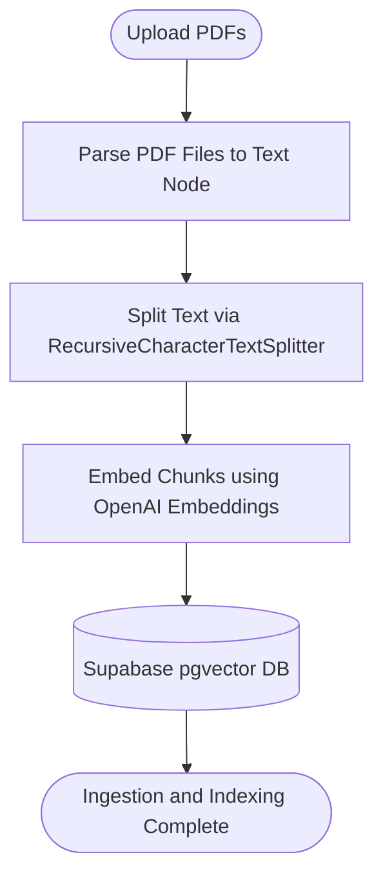
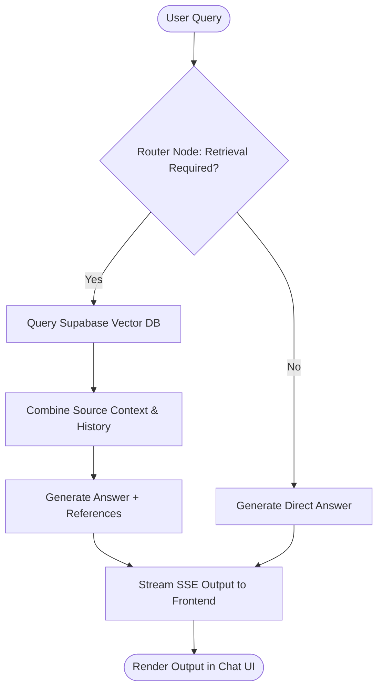

# Agentic AI PDF Chatbot & Search Agent

An advanced, full-stack RAG (Retrieval-Augmented Generation) application designed for uploading, indexing, and conversing with PDF documents. The system features a state-of-the-art agentic workflow orchestrating document ingestion, semantic vector retrieval, and contextual citations, built using **LangGraph**, **LangChain**, **Next.js**, and **Supabase (pgvector)**.

[](#)
[](#)
[](#)
[](#)
[](LICENSE)

---

## 🌟 Key Features

- **Agentic RAG Workflows**: Utilizes **LangGraph** to model complex, state-driven search, routing, and ingestion pipelines.
- **Dynamic Retrieval Router**: Automatically determines if a query needs semantic document retrieval or direct model response.
- **Stateful Document Ingestion**: Ingests, parses, chunks (via recursive splitting), embeds, and stores PDF documents in a vector store.
- **Semantic Vector Storage**: Leverages **Supabase (pgvector)** for storing high-dimensional embeddings and executing cosine similarity search queries.
- **Real-Time Stream Answering (SSE)**: Delivers partial responses to the frontend client UI in real time via Server-Sent Events (SSE).
- **Interactive Chat Interface**: Includes drag-and-drop file upload, inline conversational history, clear citations/sources view, and micro-animations.
- **Turborepo Monorepo**: Cleaner code separating frontend and backend packages with instant caching and builds.

---

## 🏗️ Architecture Overview

The system is designed into independent **Frontend** and **Backend** modules operating within a Turborepo-managed monorepo.

### System Diagram

```
┌─────────────────────┐    1. Ingest PDF       ┌───────────────────────────┐
│  Frontend (Next.js) │ ─────────────────────> │ Backend (Node.js/TS)      │
│  - React UI & Chat  │                        │ - LangGraph Ingestion     │
│  - Upload .pdf files│ <───────────────────── │   + Chunking & Embeddings │
└─────────────────────┘     2. Acknowledge     │   + SUPABASE PGVector     │
                                               └───────────────────────────┘

┌─────────────────────┐    3. Query chat       ┌───────────────────────────┐
│  Frontend (Next.js) │ ─────────────────────> │ Backend (Node.js/TS)      │
│  - Chat interface   │                        │ - LangGraph Retrieval     │
│  - SSE stream & cite│ <───────────────────── │   + Context Retrieval     │
└─────────────────────┘      4. Stream SSE     │   + Citation Formatter    │
                                               └───────────────────────────┘
```

### 1. Ingestion Flow (Stateful Graph)


### 2. Conversational Retrieval Flow (Stateful Graph)


---

## 🛠️ Tech Stack & Dependencies

- **Frontend**: Next.js 14, React 18, Tailwind CSS, Lucide React, Radix UI components
- **Backend / Agent**: Node.js, TypeScript, LangChain v0.3, LangGraph v0.2, LangGraph SDK & CLI
- **Database / Vector Engine**: Supabase (PostgreSQL with `pgvector` extension)
- **AI Models**: OpenAI (GPT Models) + OpenAI Text Embeddings
- **Monorepo Management**: Turborepo, Yarn Workspaces, ESLint, Prettier

---

## 📁 Repository Structure

```
├── backend/                  # Node.js/TypeScript LangGraph agent service
│   ├── src/
│   │   ├── ingestion_graph/  # Stateful workflow for parsing and vector indexing
│   │   │   ├── graph.ts
│   │   │   └── state.ts
│   │   ├── retrieval_graph/  # Stateful workflow for query routing and QA citation
│   │   │   ├── graph.ts
│   │   │   ├── prompts.ts
│   │   │   └── state.ts
│   │   └── shared/           # Database clients, helpers, and configurations
│   ├── package.json
│   └── tsconfig.json
├── frontend/                 # Next.js web portal with interactive UI
│   ├── app/                  # App Router components & Ingest/Chat API routes
│   │   ├── api/
│   │   │   ├── chat/route.ts
│   │   │   └── ingest/route.ts
│   │   └── page.tsx
│   ├── components/           # Reusable UI elements (Chat, Upload, Layout)
│   ├── package.json
│   └── tailwind.config.ts
├── package.json              # Monorepo root and workspace configuration
├── turbo.json                # Turborepo task runner system
└── yarn.lock
```

---

## ⚡ Setup & Installation

### 1. Prerequisites
- **Node.js**: v18+ (Node.js v20 or later is recommended)
- **Yarn**: package manager
- **Supabase Account**: A database with vector capabilities
- **OpenAI API Key**: For embedding generation and LLM query parsing

### 2. Clone and Install Dependencies
```bash
git clone https://github.com/your-username/ai-pdf.git
cd ai-pdf
yarn install
```

### 3. Database Setup (Supabase)
To store embeddings, standard tables must be created in your Supabase database instance. Run the following SQL queries inside your Supabase SQL editor:

```sql
-- Enable the pgvector extension to support vector data types
create extension if not exists vector;

-- Create the documents table
create table if not exists documents (
  id bigserial primary key,
  content text, -- corresponds to Document.pageContent
  metadata jsonb, -- corresponds to Document.metadata
  embedding vector(1536) -- 1536 dimensions for OpenAI text-embedding-3-small / text-embedding-ada-002
);

-- Create the similarity match function
create or replace function match_documents (
  query_embedding vector(1536),
  match_count int,
  filter jsonb default '{}'
) returns table (
  id bigint,
  content text,
  metadata jsonb,
  similarity float
)
language plpgsql
as $$
#variable_conflict use_column
begin
  return query
  select
    documents.id,
    documents.content,
    documents.metadata,
    1 - (documents.embedding <=> query_embedding) as similarity
  from documents
  where documents.metadata @> filter
  order by documents.embedding <=> query_embedding
  limit match_count;
end;
$$;
```

---

## 🔧 Environment Configuration

Create environment configuration files for both `backend` and `frontend`.

### Backend Setup (`backend/.env`):
Create custom `backend/.env` file:
```env
OPENAI_API_KEY=your-openai-api-key
SUPABASE_URL=your-supabase-project-url
SUPABASE_SERVICE_ROLE_KEY=your-supabase-service-role-key
```

### Frontend Setup (`frontend/.env`):
Create custom `frontend/.env` file:
```env
NEXT_PUBLIC_LANGGRAPH_API_URL=http://localhost:2024
LANGGRAPH_INGESTION_ASSISTANT_ID=ingestion_graph
LANGGRAPH_RETRIEVAL_ASSISTANT_ID=retrieval_graph
```

*(Optional: configure `LANGCHAIN_TRACING_V2=true` and `LANGCHAIN_API_KEY` for detailed application tracing via LangSmith)*

---

## 🚀 Running Locally

This workspace is managed by Turborepo. You can run packages independently or in parallel.

### Method A: Running dev servers individually (Recommended)

1. **Start the LangGraph Backend Server**:
   ```bash
   cd backend
   yarn langgraph:dev
   ```
   This script runs the LangGraph CLI, hosting a local graph service at `http://localhost:2024` with a debugger endpoint.

2. **Start the Next.js Frontend App**:
   ```bash
   cd frontend
   yarn dev
   ```
   This spins up the web UI on `http://localhost:3000`.

---

## 💡 Usage Guide

1. Open the UI in your web browser: [http://localhost:3000](http://localhost:3000).
2. **Ingest Documents**: Click the paperclip icon in the chat interface, upload your target PDF document(s). The system triggers the ingestion graph which extracts, splits, embeds, and saves document chunks in Supabase.
3. **Conversational Search**: Type queries regarding details within your uploaded document. The assistant evaluates queries, queries vector nodes if relevant document chunks exist, generates detailed answers using the model context, and structures citations linking back to original chunks.
4. **Inspect & Debug**: Access local LangGraph logs/tracing to view state variables, active node executions, and token metrics.

---

## 🧪 Testing and Quality Control

### Running Unit & Integration Tests
```bash
# Test the backend agents
cd backend
yarn test

# Test the frontend elements
cd frontend
yarn test
```

### Formatting and Linting
```bash
# Check code style rules across the monorepo
yarn lint
yarn format
```

---

## 📄 License

This codebase is licensed under the [MIT License](LICENSE).
